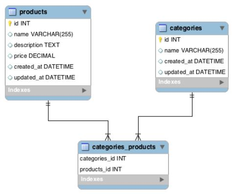
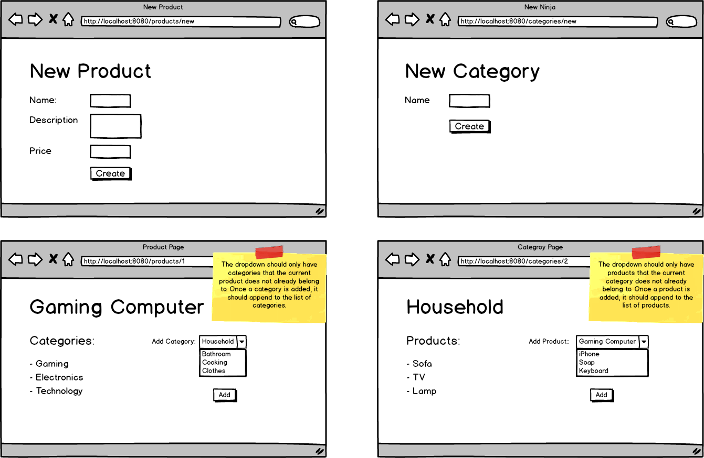
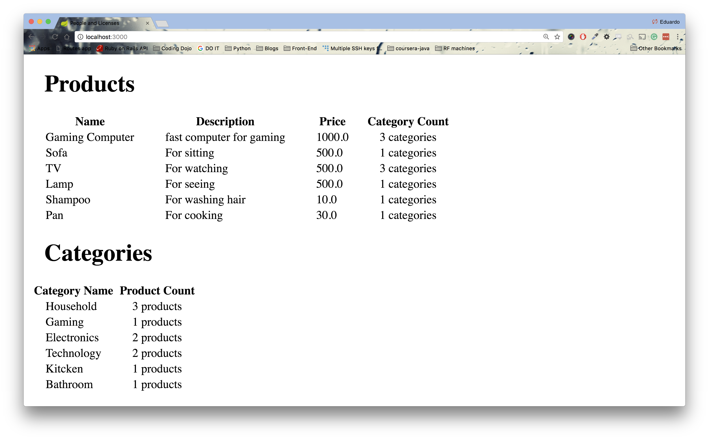

# Java_Products_and_Categories
A Java application that will keep track of products and categories.

<h3>Tasks:</h3>

● Allow users to create a product.

● Allow users to create a new category.

● In the products show page, allow users to add a category to a specific product.

● In the categories show page, allow users to add a product to a specific category

ERD and Wireframe

